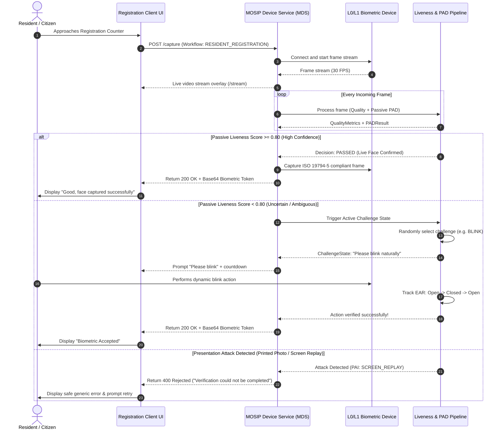
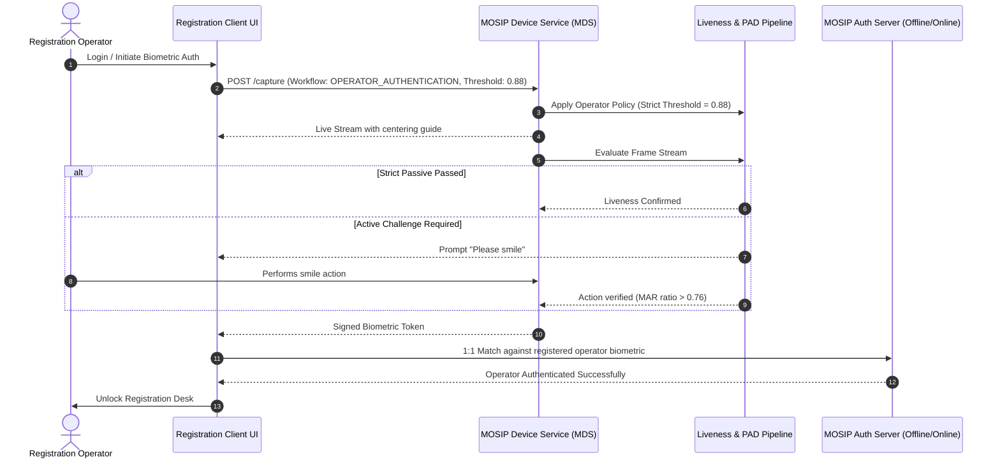
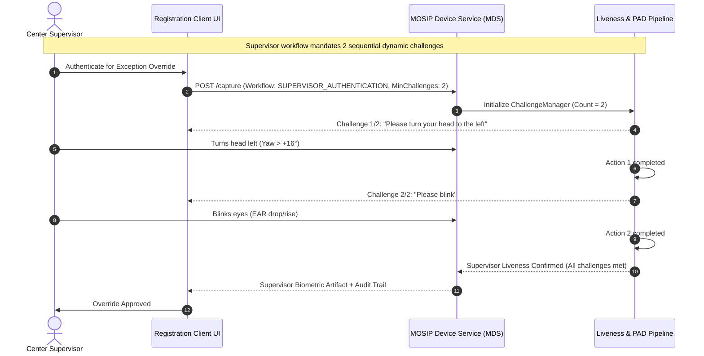
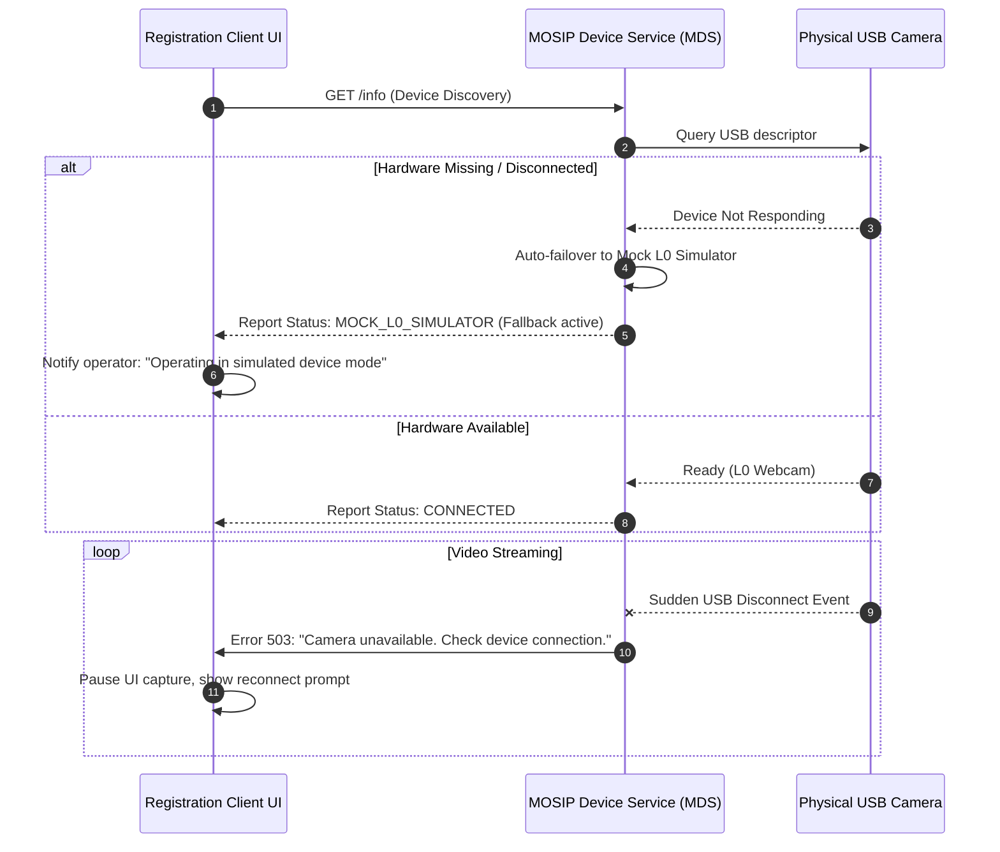

# MOSIP Liveness & PAD Subsystem - Sequence Diagrams

This document contains end-to-end Mermaid sequence diagrams for all biometric workflows defined in MOSIP Decode Problem Statement 04.

---

## 1. Resident Registration Flow (Hybrid Passive-to-Active)

---

## 2. Operator Authentication Flow

---

## 3. Supervisor Override & Multi-Challenge Authentication Flow

---

## 4. Device Error Handling & Disconnection Recovery Flow

