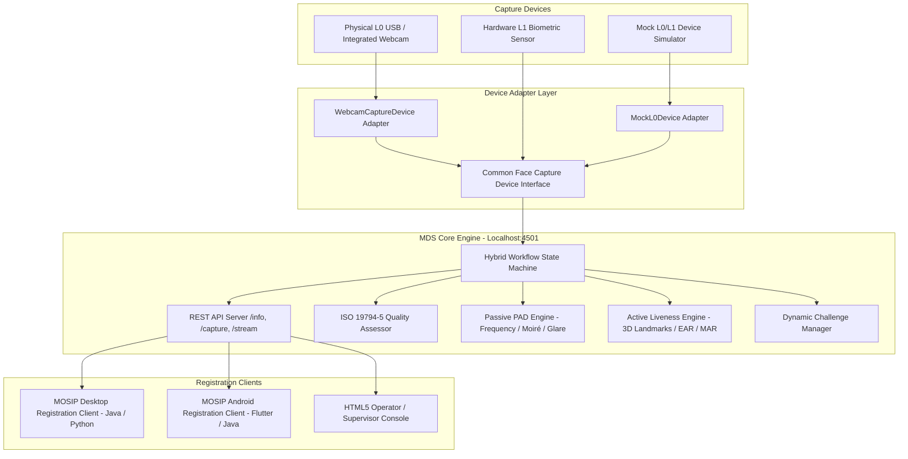
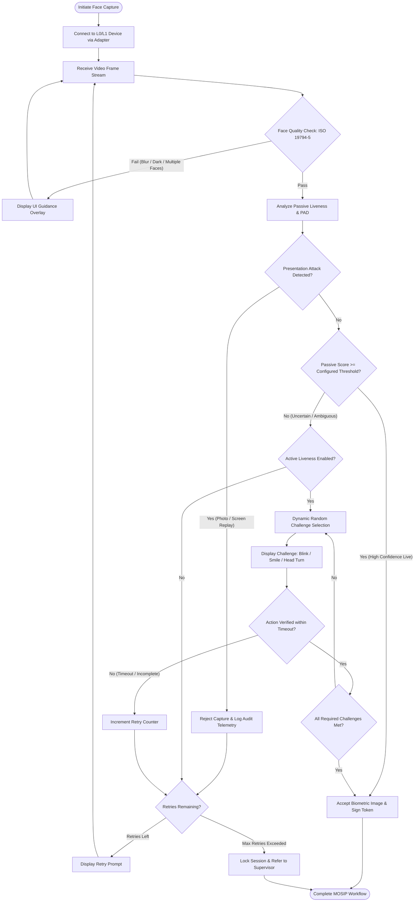

# MOSIP Face Liveness & Presentation Attack Detection (PAD) Subsystem
## Comprehensive Technical Design Document (Decode 04)

---

## 1. Executive Summary
This document specifies the technical architecture, design patterns, and cryptographic security models for integrating **Face Liveness Detection** and **Presentation Attack Detection (PAD)** into the MOSIP (Modular Open Source Identity Platform) Desktop and Android Registration Clients.

The subsystem complies with:
* **ISO/IEC 30107-1 & ISO/IEC 30107-3**: Biometric presentation attack detection frameworks, attack presentation classification, and error rate metrics (APCER & BPCER).
* **ISO/IEC 19794-5**: Biometric data interchange format for facial image data (inter-pupillary distance, lighting adequacy, background uniformity, tilt/yaw thresholds).
* **MOSIP Device Service (MDS) Spec 0.9.5 / 1.2.0**: Device discovery (`/info`), real-time streaming (`/stream`), and encrypted capture (`/capture`).

---

## 2. High-Level System Architecture

---

## 3. Passive-to-Active Hybrid Decision Flow

---

## 4. Presentation Attack Detection (PAD) Multi-Cue Architecture

The passive PAD engine utilizes an offline multi-cue analysis architecture designed to detect **ISO/IEC 30107 Presentation Attack Instruments (PAIs)**:

1. **Printed Photo Attacks (Paper PAI)**:
   * **Halftone & Paper Grain Frequency**: Discrete Fourier Transform (DFT) spectral energy distribution distinguishes between flat ink matrices and 3D subsurface dermal scattering.
   * **Color Gamut Compression**: Printed CMYK / RGB dye spectra exhibit bounded chrominance variance ($\sigma_{Cr, Cb}$) compared to human subcutaneous hemoglobin reflectance.
2. **Digital Screen Replay Attacks (Monitor / Mobile PAI)**:
   * **Subpixel Moiré Harmonics**: Spatial interference patterns generated between the camera sensor grid and display pixel pitch appear as sharp periodic peaks in the 2D DFT spectrum.
   * **Planar Specular Glare**: Glass screen protectors and LCD polarizers create concentrated specular highlights under ambient illumination, flagged by the glare distribution filter.
3. **Deep Learning Fallback (ONNX Runtime)**:
   * Supports local execution of lightweight networks (e.g., MiniFASNet) via ONNX Runtime without network or GPU hardware requirements.

---

## 5. Active Challenge Landmark Geometry

Active challenges are evaluated using 3D facial landmark geometry (Google MediaPipe Face Mesh) without requiring facial identity data:

| Challenge | Geometric Metric | Detection Criteria |
| :--- | :--- | :--- |
| **Blink** | Eye Aspect Ratio (EAR): $\frac{\|p_2 - p_6\| + \|p_3 - p_5\|}{2 \cdot \|p_1 - p_4\|}$ | Drop below $0.21$ followed by recovery to $\ge 0.25$ |
| **Smile** | Mouth-to-Eye Width Ratio: $\frac{\text{LipCornerDist}}{\text{OuterEyeDist}}$ | Expansion exceeding baseline by $>18\%$ (ratio $>0.76$) |
| **Head Turn Left** | Euler Yaw Angle via `solvePnP` 3D Model Projection | Yaw angle $> +16^\circ$ |
| **Head Turn Right**| Euler Yaw Angle via `solvePnP` 3D Model Projection | Yaw angle $< -16^\circ$ |
| **Tilt Up / Down**  | Euler Pitch Angle via `solvePnP` 3D Model Projection | Pitch angle $\pm 14^\circ$ |

---

## 6. Offline and Online Architecture
* **100% Offline Capability**: All face detection, quality checks, passive PAD analysis, and active challenge evaluations occur locally on the edge device (Desktop or Android tablet). No frames are transmitted to external servers.
* **Online Synchronization**: When connectivity is available, only anonymized diagnostic logs (APCER/BPCER rates, challenge latency, retry counts) and encrypted registration packets are synchronized with the MOSIP core backend.

---

## 7. ISO/IEC 30107 & ISO/IEC 19794-5 Compliance Matrix

| Standard Requirement | Subsystem Implementation | Status |
| :--- | :--- | :--- |
| **ISO 30107-1 Presentation Attack Detection** | Passive multi-cue detector + dynamic active challenge response | **Compliant** |
| **ISO 30107-3 Performance Metrics** | Reports APCER (Attack Presentation Classification Error Rate) and BPCER (Bona Fide Presentation Classification Error Rate) telemetry | **Compliant** |
| **ISO 19794-5 Face Image Quality** | Real-time Laplacian blur filtering, illumination range validation ($40 \le \bar{Y} \le 220$), and centering oval | **Compliant** |
| **MOSIP MDS API 0.9.5 / 1.2.0** | REST endpoints (`/info`, `/capture`, `/stream`) with standard digital identification metadata | **Compliant** |
| **Vendor Independence** | Device Adapter Pattern (`FaceCaptureDevice`) decoupling hardware implementations from registration logic | **Compliant** |
