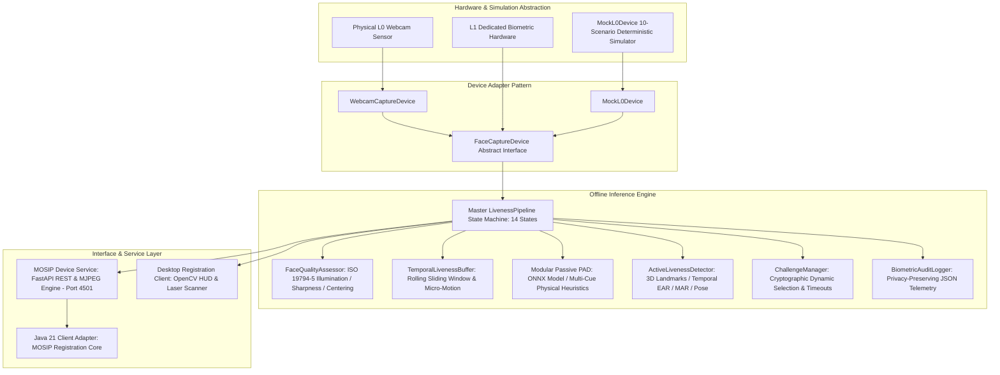
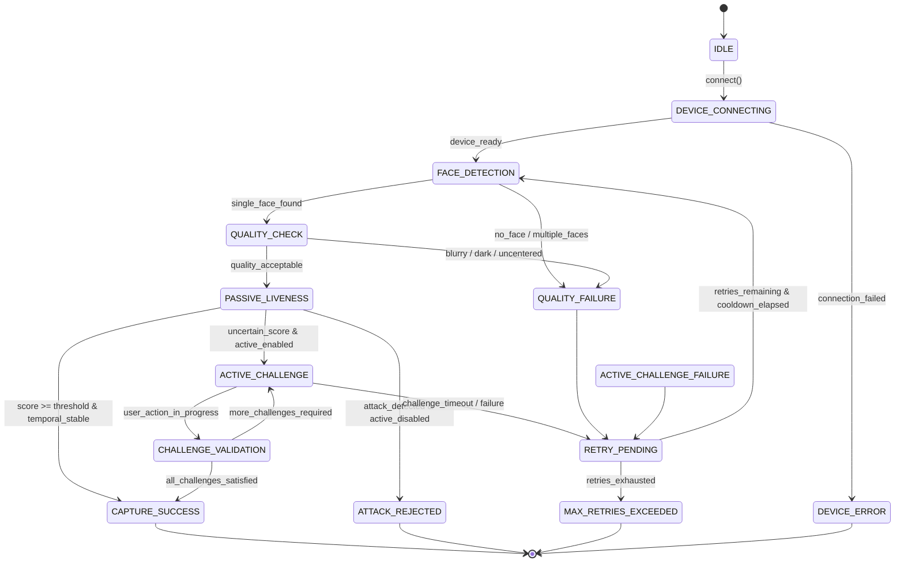

# MOSIP Face Liveness & Presentation Attack Detection (PAD) Subsystem
## Comprehensive Technical Design Document (Decode 2026 - Problem 04)

---

## 1. Executive Summary & Design Scope
This document specifies the technical architecture, algorithms, and design patterns for integrating **Face Liveness Detection** and **Presentation Attack Detection (PAD)** into the MOSIP (Modular Open Source Identity Platform) Desktop and Android Registration Clients.

The subsystem is architected in accordance with:
* **ISO/IEC 30107-1 & ISO/IEC 30107-3**: Presentation attack detection definitions, presentation attack instrument (PAI) categories, evaluation protocol methodology, and metric reporting (APCER and BPCER).
* **ISO/IEC 19794-5**: Biometric data interchange format for facial image data (illumination adequacy, sharpness/blur assessment, single-face constraint, and centering constraints).
* **MOSIP Device Service (MDS) Specification**: Decoupled biometric device discovery (`GET /info`), streaming (`GET /stream`), and biometric capture (`POST /capture`).

> **Note on Laboratory Certification**: The subsystem is designed and implemented strictly according to ISO/IEC 30107 principles and performance requirements. Formal certification requires an accredited testing laboratory (such as iBeta or FIDO Alliance).

---

## 2. High-Level Architecture & Layered Design



---

## 3. Finite State Machine (FSM) Lifecycle

The pipeline implements an explicit 14-state lifecycle ensuring deterministic transitions and testability:



---

## 4. Passive Presentation Attack Detection (PAD) Architecture

Passive PAD evaluates physical biometric properties across individual frames and temporal sequences without requiring conscious user participation:

### 4.1 Modular Engine Design
* **`ONNXModelPADBackend`**: An isolated interface accepting pre-trained neural networks (e.g., MiniFASNet, Silent-Face-Anti-Spoofing) in standard `.onnx` format. Operates via `onnxruntime` with zero cloud or GPU dependencies.
* **`HeuristicPADBackend`**: Deterministic physical texture and optical analysis engine providing reliable offline defense:
  1. **2D Fourier Transform (DFT) Frequency Analysis**: Computes high-frequency spectral ratios to identify paper print halftone matrices, inkjet dots, and digital pixel grids.
  2. **Subcutaneous Chrominance Distribution**: Evaluates $YCrCb$ standard deviation ($\sigma_{Cr}, \sigma_{Cb}$). Flat paper prints exhibit crushed color gamut ($\sigma < 5.0$), while digital displays exhibit unnatural saturation ($\sigma > 34.0$).
  3. **Specular Glare & Planar Glass Reflection**: Detects saturated specular highlight clusters ($Y \ge 252$) characteristic of planar smartphone/tablet screen protectors under ambient lighting.
  4. **Micro-Texture Gradient Distribution**: Computes Sobel first-order spatial derivatives to detect natural facial pore structure vs smooth photographic print paper.
* **Calibrated Confidence**: Computes dispersion across cues and exposes a 4-way classification verdict:
  * `BONA_FIDE_LIVE`: Liveness score $\ge$ threshold with high inter-cue agreement.
  * `UNCERTAIN`: Borderline score or conflicting cues; initiates automatic escalation to active challenges.
  * `PRESENTATION_ATTACK`: Definite attack signature detected (e.g., screen glare or halftone moiré).
  * `PROCESSING_ERROR`: Invalid face crop, severe blur, or out-of-bounds crop.
* **Operational Mode Reporting**: Explicitly tags every result with `operational_mode` (`MODEL` or `HEURISTIC`) ensuring zero deceptive claims.

---

## 5. Temporal Liveness Window (`TemporalLivenessBuffer`)

To prevent single anomalous frames or transient sensor noise from prematurely rejecting or accepting a subject, the pipeline maintains a sliding temporal frame buffer:

* **Configurable Window**: Tracks the last $N$ frames (default: 15–25 frames, $\approx 0.5 - 1.0$ second).
* **Rolling Weighted Confidence**: Recent frames are weighted with linear progression:
  $$w_i = \frac{i}{\sum_{k=1}^N k}, \quad S_{\text{rolling}} = \sum_{i=1}^N w_i \cdot s_i$$
* **Bounded Stability**: Computes $\min(s_i)$, $\max(s_i)$, and standard deviation $\sigma_s$ across the temporal window. Stability is defined as $1.0 - \text{clip}(2 \cdot \sigma_s, 0, 1)$.
* **Micro-Motion Trajectory**: Calculates optical Euclidean jitter of the facial centroid across frames:
  $$\Delta d_i = \sqrt{(x_i - x_{i-1})^2 + (y_i - y_{i-1})^2}$$
  Completely rigid, frozen presentations (e.g. printed paper photo on cardboard) exhibit $\sigma_{\Delta d} \approx 0.0$, triggering liveness penalty.

---

## 6. Dynamic Active Challenge Mechanics

When passive confidence is borderline or workflow policies mandate interactive verification, the system executes randomized active challenges:

* **Cryptographic Random Selection**: Utilizes Python's `secrets.SystemRandom()` to prevent replay attacks based on predictable sequences.
* **No Immediate Repetition**: Challenge pool guarantees subsequent challenges do not repeat the previous challenge.
* **Temporal State Machines**:
  1. **Blink Detection**: Evaluates Eye Aspect Ratio (EAR):
     $$\text{EAR} = \frac{\|p_2 - p_6\| + \|p_3 - p_5\|}{2 \cdot \|p_1 - p_4\|}$$
     Strict three-phase validation:
     $$\text{INIT (EAR} \ge 0.23) \longrightarrow \text{CLOSED (EAR} \le 0.17) \longrightarrow \text{RECOVERY (EAR} \ge 0.22)$$
     Rejects static images with closed eyes or single-frame blinks.
  2. **Smile Detection**: Baseline-neutral differential calculation:
     $$\Delta \text{MAR} = \text{MAR}_t - \text{MAR}_{\text{baseline}}$$
     Requires relative expansion $\ge 0.15$ held for at least 3 consecutive frames.
  3. **Head Turn Detection**: Uses Perspective-n-Point (`solvePnP`) with canonical 3D facial landmarks to extract Euler angles. Requires:
     $$\text{CENTER (Yaw} \approx 0^\circ) \longrightarrow \text{TURN (Yaw} > 16^\circ \text{ or } < -16^\circ) \longrightarrow \text{CENTER (Yaw} \approx 0^\circ)$$

---

## 7. Device Abstraction & Mock Simulation

The pipeline interacts with devices solely through the `FaceCaptureDevice` interface:
```python
class FaceCaptureDevice(ABC):
    def connect(self) -> bool: ...
    def disconnect(self) -> None: ...
    def is_connected(self) -> bool: ...
    def is_available(self) -> bool: ...
    def get_device_info(self) -> DeviceInfo: ...
    def start_stream(self) -> bool: ...
    def stop_stream(self) -> None: ...
    def read_frame(self) -> Tuple[bool, Optional[VideoFrame]]: ...
```

### Deterministic Mock Simulator (`MockL0Device`)
Supports reproducible automated testing across 10 scenarios:
1. `BONA_FIDE_LIVE`: Physiological tremor + subtle sensor noise.
2. `STATIC_PHOTO_ATTACK`: Rigid paper print simulation with flattened chrominance.
3. `SCREEN_REPLAY_ATTACK`: Sinusoidal moiré grid interference + specular forehead reflection.
4. `NO_FACE`: Empty scene.
5. `MULTIPLE_FACES`: Dual-subject presentation.
6. `POOR_LIGHTING_DARK`: Underexposed scene ($\bar{Y} < 40$).
7. `POOR_LIGHTING_BRIGHT`: Overexposed washed-out scene ($\bar{Y} > 220$).
8. `POOR_LIGHTING_UNEVEN`: Unbalanced lateral shadows.
9. `BLURRY_FRAME`: Gaussian motion/focus blur ($\sigma_{\text{Laplace}} < 30$).
10. `DEVICE_DISCONNECT`: Mid-stream hardware disconnection.

---

## 8. Security, Privacy & Diagnostic Isolation

### Safe User Messaging Taxonomy
Internal diagnostic codes are decoupled from user-facing prompts to prevent attackers from gaming thresholds:

| Internal BiometricErrorCode | Technical Cause | Safe End-User Message |
| :--- | :--- | :--- |
| `NO_FACE` | Face count == 0 | "Face not detected. Please look directly at the camera." |
| `MULTIPLE_FACES` | Face count > 1 | "Multiple faces detected. Only one person should be in frame." |
| `POOR_LIGHTING` | Illumination out of bounds | "Lighting is inadequate. Please move to a well-lit area." |
| `BLURRY_FACE` | Laplacian variance < 30 | "Image is blurry. Please remain still during capture." |
| `PAD_ATTACK_DETECTED` | Moiré / Glare / Paper attack | "Face verification could not be completed. Please position your face and try again." |
| `ACTIVE_CHALLENGE_TIMEOUT` | Countdown expired | "Challenge timed out. Please follow the on-screen instructions." |

### Privacy-Preserving Structured Audit Logging
* Emits structured JSON events with unique UUIDs and ISO 8601 timestamps:
  ```json
  {"eventId": "4323a378-bc4d-498b-a223-991edc13ceff", "timestamp": 1791015209.412, "isoTimestamp": "2026-10-03T08:13:29Z", "eventType": "PAD_ATTACK_DETECTED", "sessionId": "9db483b1-3120-4bdf-a8c3-6dbd632d5047", "workflow": "RESIDENT_REGISTRATION", "details": {"attack_type": "SCREEN_REPLAY", "liveness_score": 0.38, "mode": "HEURISTIC"}}
  ```
* **Zero Biometric Leakage**: Facial image pixel buffers and identity markers are strictly excluded from logs.
