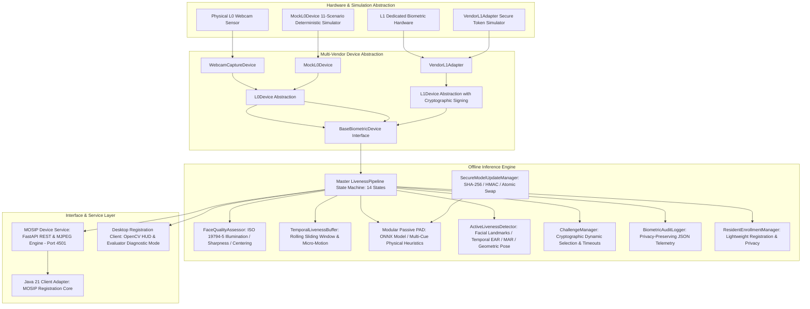
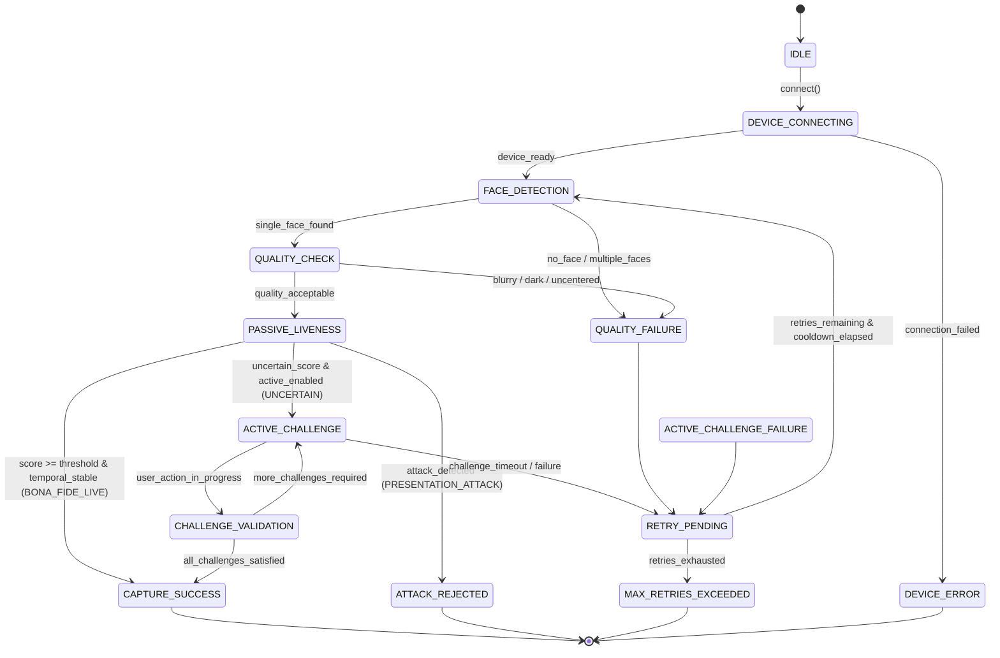
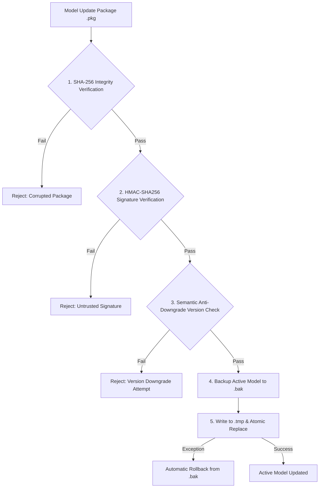

# MOSIP Face Liveness & Presentation Attack Detection (PAD) Subsystem
## Comprehensive Technical Design Document (Decode 2026 - Problem 04)

---

## 1. Executive Summary & Design Scope
This document specifies the technical architecture, algorithms, and design patterns for integrating **Face Liveness Detection** and **Presentation Attack Detection (PAD)** into the MOSIP (Modular Open Source Identity Platform) Desktop and Android Registration Clients.

The subsystem is architected in accordance with:
* **ISO/IEC 30107-1 & ISO/IEC 30107-3**: Presentation attack detection definitions, presentation attack instrument (PAI) categories, evaluation protocol methodology, and metric reporting (APCER and BPCER).
* **ISO/IEC 19794-5**: Biometric data interchange format for facial image data (illumination adequacy, sharpness/blur assessment, single-face constraint, and centering constraints).
* **MOSIP Device Service (MDS) Specification**: Decoupled biometric device discovery (`GET /info`), streaming (`GET /stream`), and biometric capture (`POST /capture`).

> **Note on Laboratory Certification**: The subsystem is designed and implemented strictly according to ISO/IEC 30107 principles and performance requirements. Formal certification requires an accredited testing laboratory (such as iBeta or FIDO Alliance).

---

## 2. High-Level Architecture & Layered Design



---

## 3. Finite State Machine (FSM) Lifecycle

The pipeline implements an explicit 14-state lifecycle ensuring deterministic transitions and testability:



### Hybrid Decision Semantics
1. **`BONA_FIDE_LIVE`**: Liveness score meets or exceeds the configured policy threshold ($0.80 - 0.92$) and temporal stability $\ge 0.60$. Directly completes capture (`CAPTURE_SUCCESS`).
2. **`UNCERTAIN`**: Liveness score is borderline or cues exhibit high dispersion. Automatically escalates to dynamic interactive active challenges.
3. **`PRESENTATION_ATTACK`**: Definite attack signature detected (e.g. screen glare highlight, moiré harmonics, flat paper gamut). Immediately rejected (`ATTACK_REJECTED`) without escalating to active challenges.
4. **`PROCESSING_ERROR`**: Invalid crop or severe motion blur. Guided retry without penalty.

---

## 4. Multi-Vendor L0 / L1 Device Architecture

The device layer cleanly separates standard optical sensors from cryptographically secure biometric hardware:

```
BaseBiometricDevice (Abstract)
├── L0Device
│     ├── WebcamCaptureDevice (DirectShow / UVC physical camera)
│     └── MockL0Device (11-scenario deterministic simulator)
└── L1Device
      └── VendorL1Adapter (Architecture-ready adapter for vendor SDKs)
```

### Device Capabilities Discovery (`DeviceCapabilities`)
Every device provides structured metadata for MDS discovery:
* `device_type`: `PHYSICAL_L0_WEBCAM`, `MOCK_L0_SIMULATOR`, `HARDWARE_L1_BIOMETRIC`, or `VENDOR_L1_ADAPTER`
* `vendor`, `model`, `firmware_version`
* `security_level`: `"L0_BASIC"`, `"L0_SIMULATED"`, `"L1_SIMULATED"` (reserved: `"L1_SECURE_HARDWARE"` for certified physical hardware)
* `supported_capture_modes`: `["STREAM", "STILL_FRAME", "CRYPTO_TOKEN"]`
* `liveness_capabilities`: Supported hardware/software PAD indicators

### Simulated L1 Hardware Integration (`VendorL1Adapter`)
VendorL1Adapter demonstrates the integration contract and simulator behavior; actual L1 hardware requires vendor SDK/device integration. L1 devices incorporate on-chip cryptographic signing (`sign_biometric_data()`) and physical tamper detection (`verify_tamper_status()`). The `VendorL1Adapter` provides a concrete integration point where physical vendor SDKs (e.g., Suprema, Idemia, Dermalog, Mantra) attach their native C/C++ drivers.

---

## 5. Model Versioning & Provenance Tracking

Every biometric evaluation generates complete provenance records via `ModelMetadata`:
* `backend_name`: `"onnx_deep_learning"` or `"heuristic_multi_cue"`
* `version`: Version identifier (e.g. `"v1.0.0-onnx"` or `"v1.2.0-heuristic"`)
* `model_hash`: SHA-256 hex digest of the model binary or descriptive provenance
* `input_size`: Dimensions of neural network input tensor
* `inference_provider`: Hardware accelerator utilized (e.g. `CUDAExecutionProvider`, `DirectMLExecutionProvider`, `CPUExecutionProvider`)
* `threshold`: Decision boundary threshold applied

### ONNX Model Contract & Output Layout Specification
* **Status**: `ARCHITECTURE-READY`. The inference engine (`ONNXModelPADBackend`) is fully implemented with dynamic hardware provider discovery (DirectML, CUDA, OpenVINO, CPU) and SHA-256 model provenance. Pre-trained deep-learning production weights are **not** bundled; deterministic multi-cue physical heuristics serve as the active engine.
* **Input Tensor**: Shape `[1, 3, 224, 224]` (NCHW format, float32, RGB), normalized using ImageNet mean `[0.485, 0.456, 0.406]` and std `[0.229, 0.224, 0.225]`.
* **Output Tensor Contract**: Binary classification layout `[prob_live, prob_spoof]` over Softmax probabilities. If a single logit is produced, `prob_spoof = 1.0 - prob_live`.
* **Plug-and-Play Placement**: Drop any compatible `.onnx` model into `assets/models/` to automatically activate deep-learning inference with zero code modifications.

---

## 6. Secure Offline Model Update Subsystem (`SecureModelUpdateManager`)

For isolated enrollment centers operating without internet connectivity, model updates are distributed in signed offline packages:



---

## 7. Low-Resource Edge & Android Optimization Strategy

While this submission focuses on the Desktop/Linux/Windows registration client, the codebase is architecturally prepared for low-resource Android tablets:

1. **Adaptive Frame Subsampling**:
   * Passive PAD frequency analysis (2D DFT) executes every 3rd frame ($\approx 10$ Hz), reducing CPU load by 60%.
   * Facial landmark tracking (MediaPipe) runs at native 30 FPS for smooth user interaction.
2. **Quantized Mobile Models**:
   * The `ONNXModelPADBackend` accepts 8-bit quantized models (`int8`), reducing memory footprint from 45MB to under 8MB.
3. **Hardware Acceleration Discovery**:
   * Uses `onnxruntime.get_available_providers()` to dynamically select `NNAPIExecutionProvider` on Android, `DirectMLExecutionProvider` on Windows, or `CUDAExecutionProvider` on Nvidia edge devices, with transparent fallback to `CPUExecutionProvider`.

---

## 8. Security, Privacy & Diagnostic Isolation

### Safe User Messaging Taxonomy
Internal diagnostic codes are strictly decoupled from user-facing prompts:

| Internal BiometricErrorCode | Technical Cause | Safe End-User Message |
| :--- | :--- | :--- |
| `NO_FACE` | Face count == 0 | "Face not detected. Please look directly at the camera." |
| `MULTIPLE_FACES` | Face count > 1 | "Multiple faces detected. Only one person should be in frame." |
| `POOR_LIGHTING` | Illumination out of bounds | "Lighting is inadequate. Please move to a well-lit area." |
| `BLURRY_FACE` | Laplacian variance < 30 | "Image is blurry. Please remain still during capture." |
| `PAD_ATTACK_DETECTED` | Moiré / Glare / Paper attack | "Face verification could not be completed. Please position your face and try again." |
| `ACTIVE_CHALLENGE_TIMEOUT` | Countdown expired | "Challenge timed out. Please follow the on-screen instructions." |

### Privacy-Preserving Structured Audit Logging
Structured JSON events record session tokens and metrics while strictly omitting raw facial imagery:
```json
{"eventId": "4323a378-bc4d-498b-a223-991edc13ceff", "timestamp": 1791015209.412, "isoTimestamp": "2026-10-03T08:13:29Z", "eventType": "PAD_ATTACK_DETECTED", "sessionId": "9db483b1-3120-4bdf-a8c3-6dbd632d5047", "workflow": "RESIDENT_REGISTRATION", "details": {"attack_type": "SCREEN_REPLAY", "liveness_score": 0.38, "mode": "HEURISTIC", "model_version": "v1.2.0-heuristic"}}
```

---

## 9. Lightweight Resident Enrollment & Strict Privacy Architecture

To meet MOSIP's real-world registration station operational requirements without introducing bloat (such as user databases, password management, or web-app sessions), the subsystem incorporates a lightweight, focused biometric enrollment manager:

```
┌────────────────────────────────────────────────────────┐
│             RESIDENT ENROLLMENT LIFECYCLE              │
└────────────────────────────────────────────────────────┘
                          START
                            │
                            ▼
                    [ Enter/Generate ID ] (RES-00123)
                            │
                            ▼
                    [ Face Positioning ] (ISO 19794-5 Quality Check)
                            │
                            ▼
                  [ Liveness Verification ]
                            │
             ┌──────────────┴──────────────┐
             ▼                             ▼
       BONA_FIDE_LIVE                  UNCERTAIN
             │                             │
             │                             ▼
             │                     [ Active Challenge ]
             │                             │
             └──────────────┬──────────────┘
                            │ Pass
                            ▼
                   [ ENROLLMENT SUCCESS ]
            (Cryptographic Biometric Token SHA-256)
```

### Core Architecture Components
1. **`ResidentEnrollmentManager` (`src/core/enrollment.py`)**:
   * Tracks dynamic enrollment states: `READY`, `POSITIONING`, `LIVENESS_CHECK`, `ENROLLED`, `REJECTED`, `FAILED`.
   * Manages predictable `RES-XXXXX` identifier token sequences (with custom override support via CLI flag `--resident-id` or interactive hotkey `'n'`).
   * Provides 3-step checklist status for desktop UI HUD overlays:
     * `Step 1: Position Face`
     * `Step 2: Liveness Check`
     * `Step 3: Enrolled`

2. **Strict Data Privacy & Zero Biometric Persistence**:
   * **Ephemeral In-Memory Processing**: Captured camera frames exist solely in volatile memory during pipeline processing and are discarded immediately upon frame cycle completion.
   * **No Raw Image Storage**: Neither the audit logs nor the `ResidentEnrollmentRecord` store raw pixel arrays, JPEG/PNG files, or face crops.
   * **Cryptographic Biometric Token Hashing**: Upon successful enrollment, the system generates an ISO/IEC 19794-5-aligned representation and computes a SHA-256 digest (`token_hash = sha256(biometric_payload)`). Downstream MOSIP registration services verify token integrity against this SHA-256 digest of the ephemeral captured image payload without exposing raw biometric imagery to the local filesystem (note: this hash serves as an integrity/token verification check, not an extracted biometric feature template for 1:1 or 1:N biometric matching).

